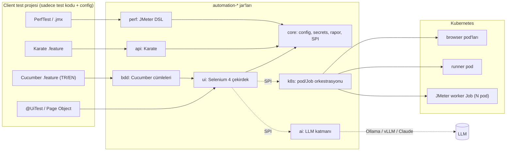

# Automation Structure

Selenium (UI), Karate (API) ve JMeter (performans) araçlarını tek bir test altyapısında toplayan, Kubernetes üzerinde koşabilen ve AI özelliklerini isteğe bağlı olarak ekleyen çok modüllü bir Java platformu. Client projeler platformu **jar olarak** (BOM ile) kullanır. Parent POM'u miras almaları gerekmez.



## Modüller

| Modül | Ne sağlar |
|---|---|
| `automation-bom` | Tüm modülleri ve birlikte test edilmiş araç sürümlerini hizalayan BOM |
| `automation-core` | Katmanlı config, execution context (local/ci), secret zinciri, Allure raporlama, test verisi, hata analizi SPI'ı |
| `automation-ui` | Selenium 4: local/grid/K8s driver provider'ları, thread-safe `DriverManager`, otomatik bekleyen `UiElement`, self-healing, JUnit 5 `@UiTest` |
| `automation-api` | Karate: config'e bağlı `ApiSuite`, `KarateBridge`, hazır auth/utils feature'ları, Allure ve hata analizi hook'ları |
| `automation-perf` | JMeter DSL: yük profilleri, SLA doğrulama, mevcut `.jmx` dosyalarını koşturma, JTL birleştirme, canlı InfluxDB/Grafana |
| `automation-k8s` | Test başına browser pod, local projeyi cluster'da koşturan remote runner, N pod'luk dağıtık JMeter, janitor |
| `automation-bdd` | Cucumber 7: hazır **Türkçe ve İngilizce** cümleler, object repository, Cucumber'dan Karate çağırma |
| `automation-ai` | Ollama/Llama, OpenAI-uyumlu (vLLM vb.) ve Claude desteği; hata triage'ı, AI self-healing, görsel doğrulama, test/veri üretimi |

`k8s` ve `ai` modülleri `ui` modülüne **SPI** ile bağlanır. Client projeye jar'ı eklemek özelliği açar, çıkarmak kapatır. Test kodu değişmez.

## Client projede kullanım

```xml
<dependencyManagement>
  <dependencies>
    <dependency>
      <groupId>io.github.semihsaydamandroid</groupId>
      <artifactId>automation-bom</artifactId>
      <version>0.1.0-SNAPSHOT</version>
      <type>pom</type>
      <scope>import</scope>
    </dependency>
  </dependencies>
</dependencyManagement>

<dependencies>
  <!-- Sadece ihtiyaç duyulanlar; sürümler BOM'dan gelir -->
  <dependency><groupId>io.github.semihsaydamandroid</groupId><artifactId>automation-ui</artifactId><scope>test</scope></dependency>
  <dependency><groupId>io.github.semihsaydamandroid</groupId><artifactId>automation-api</artifactId><scope>test</scope></dependency>
</dependencies>
```

Çalışan, eksiksiz bir örnek: [`examples/sample-client`](examples/sample-client). Bu proje UI, Karate, performans, Türkçe/İngilizce BDD ve K8s remote run örneklerini içerir.

```java
@UiTest
class LoginUiTest {
    @Test
    void validUserReachesTheSecureArea(WebDriver driver) {
        new LoginPage(driver).open()
                .loginAs("tomsmith", "SuperSecretPassword!")
                .notification().shouldContainText("You logged into a secure area!");
    }
}
```

Tarayıcının nerede koşacağı koddan değil config'ten gelir: local Chrome, Selenium Grid ya da her test için bir K8s pod'u.

## Konfigürasyon (UI, API, perf, K8s ve AI için tek kaynak)

Öncelik sırası (sonraki öncekini ezer):

1. Her jar'daki `META-INF/automation-defaults.properties`
2. Profil bazlı framework varsayılanları (`automation-defaults-ci.properties`, ör. CI'da headless)
3. Client'taki `automation.properties`
4. `automation-<profile>.properties`: profil `local` ya da `ci`. CI otomatik algılanır: Jenkins, GitHub Actions, GitLab, Azure, Tekton, Testkube...
5. `automation-<env>.properties`: `-Denv=staging` ya da `AUTOMATION_ENV`
6. Harici dosya: `-Dautomation.config.file` (ör. mount edilmiş ConfigMap)
7. Ortam değişkenleri: `AUTOMATION_UI_BROWSER=firefox` → `ui.browser`
8. System property'ler: `-Dui.browser=firefox`

Değerler şu referansları içerebilir: `${diger.anahtar}`, `${env:HOME}`, `${secret:db-password}` ve varsayılan değerli `${x:-default}`. Secret'lar ortam değişkeninden ya da K8s Secret volume'undan (`/etc/automation/secrets`) okunur. Vault gibi kaynaklar `SecretProvider` SPI'ı ile eklenir.

## Kubernetes: local ve pipeline aynı altyapıda

| Senaryo | Ne olur |
|---|---|
| `ui.execution=kubernetes` | Her test oturumu için profilin namespace'inde (`qa-local` / `qa-ci`) bir Selenium pod'u açılır. Laptop'tan port-forward ile, cluster içinden pod IP ile bağlanılır. Test bitince pod silinir. |
| `mvn -Pk8s-remote exec:java` | Local proje paketlenip runner pod'a yüklenir ve orada `mvn test` koşar. Loglar canlı akar, Allure/Karate/JMeter raporları geri indirilir. Laptop'ta tarayıcı, JMeter ya da test ağı erişimi gerekmez. |
| `DistributedLoadTest` | JMeter planı N pod'luk bir Indexed Job'a dağıtılır (aşağıda). |
| `k8s/examples/nightly-regression.yaml` | CronJob ile, CI sunucusu olmadan gece regresyonu. |

**İzolasyon ve güvenlik**
- Her kaynak `automation/profile`, `automation/owner` ve `automation/run-id` label'larını taşır.
- Her pod'da `activeDeadlineSeconds` vardır, sahipsiz pod'lar kendiliğinden ölür.
- Runner pod'u ölürse ownerReference sayesinde açtığı browser pod'ları da silinir.
- Namespace başına ResourceQuota ve LimitRange uygulanır.
- Browser pod'larına ağ erişimi NetworkPolicy ile sınırlanır.
- Kurulum için: `kubectl apply -f k8s/`

**Jenkins'i aradan çıkarabilir miyim?** Koşturucu rolünden evet, orkestrasyon rolünden hayır. Execution kontratı (image, env, pod/Job şablonu) local'de, pipeline'da ve CronJob'da aynı. Böylece CI aracı değiştirilebilir bir detaya dönüşür. Tetikleme, kalite kapısı (Job exit code), sonuç geçmişi (Allure server / ReportPortal) ve yetkilendirme yine bir yerde çözülmeli. K8s-native bir orkestratör arıyorsan Testkube'u değerlendir; bu altyapı sadece container ve `mvn` olduğu için Testkube içinde de çalışır.

### Dağıtık JMeter (ör. 40 pod)

```java
DistributedLoadTest.of(PerfTest.named("checkout").scenario(httpSampler(...)))   // veya ofJmx(Path.of("legacy.jmx"))
        .workers(40).totalThreads(2000)                                           // pod başına 50 thread
        .run().assertSla();
```

- Klasik master/slave RMI modeli kullanılmaz. Her worker planı bağımsız koşar, bu yüzden controller darboğaz olmaz ve ölçek lineer büyür.
- Pod'lar hazır olunca bekler. Hepsi Running olduğunda aynı anda başlatılır. Hepsi ayağa kalkamazsa yük hiç başlamaz; yarım yük basılmaz.
- Her worker kendi JTL'ini yazar. Controller bunları birleştirir ve tüm sample'lar üzerinden gerçek p90/p95/p99 değerlerini hesaplar.
- CSV verisi pod'lara `${__P(worker.index)}` ve `${__P(worker.count)}` ile bölünebilir.
- **Korumalar:**
  - `k8s.perf.allowed-hosts` zorunludur. Plandaki host'lar listede yoksa test başlamaz.
  - Local profilde en fazla 2 worker açılabilir.
  - Laptop'tan gerçek yük basmak (`perf.guard.*`) varsayılan olarak engellidir.
- **Uyarı:** 40 pod genelde aynı NAT/egress IP'sinden çıkar. Hedefin WAF'ı ya da rate-limit'i bunu saldırı sanabilir, cloud'da SNAT port tükenmesi yaşanabilir. Load generator'ları ayrı bir node pool'da koşturun (`k8s.perf.node-selector.*`, `k8s.perf.tolerations`).
- Worker imajı: [`docker/jmeter-worker`](docker/jmeter-worker) (JMeter 5.6.3, SHA-512 doğrulamalı).

## BDD: hazır cümleler (Cucumber, Türkçe + İngilizce)

Karate zaten Gherkin söz dizimi kullanır ama step tanımı yazdırmaz: cümleleri sabit bir HTTP DSL'idir. Bu yüzden API testleri için Karate idealdir. İş diliyle yazılan UI senaryoları için Cucumber-JVM kullanılır. Cucumber aktif geliştiriliyor (7.34.x). Eski ve güncel olmayan kısım Karate'nin 1.0 öncesi Cucumber bağımlılığıydı.

```gherkin
# language: tr
Özellik: Güvenli alana giriş
  Senaryo: Geçerli kullanıcı giriş yapar
    Diyelim ki "/login" sayfasını açarım
    Eğer ki "Kullanıcı adı" alanına "tomsmith" yazarım
    Ve "Şifre" alanına "${secret:admin-password}" yazarım
    Ve "Giriş" butonuna tıklarım
    O zaman "Bildirim" öğesi "You logged into a secure area!" içermeli
```

- **Öğe bulma:** `elements/*.locators` object repository'si (`Kullanıcı adı = id:username`) ya da doğrudan kullanıcının gördüğü isim (label, placeholder, buton metni, aria-label, test id).
- **Değerler:** `${değişken}`, `${config.anahtar}`, `${secret:x}`, `#{Name.firstName}` (Datafaker), `#{unique:qa}`.
- **Hibrit senaryo:** `"classpath:api/create-user.feature" API senaryosunu aşağıdaki değerlerle çağırırım:` ile Karate çağrılır ve sonuç değişkenleri senaryoda kullanılır. `@ignore`'lu yeniden kullanılabilir feature'lar olduğu gibi çalışır.
- Hata anında screenshot, DOM ve hata analizi Allure'a eklenir.
- **Öneri:** Hazır cümleler hızlı başlangıç içindir. Kalıcı senaryolarda `"tomsmith" kullanıcısı ile giriş yapmış olayım` gibi domain cümleleri yazın. Örnek: `examples/sample-client/.../LoginSteps.java`.

| İngilizce | Türkçe |
|---|---|
| `I open "{path}"` | `"{path}" sayfasını açarım` |
| `I click "{öğe}"` | `"{öğe}" butonuna/linkine/öğesine tıklarım` |
| `I type "{değer}" into "{öğe}"` | `"{öğe}" alanına "{değer}" yazarım` |
| `I select "{seçenek}" from "{öğe}"` | `"{öğe}" listesinden "{seçenek}" seçerim` |
| `I fill in:` (tablo) | `aşağıdaki alanları doldururum:` |
| `I should see "{metin}"` | `"{metin}" metnini görmeliyim` |
| `"{öğe}" should contain "{metin}"` | `"{öğe}" öğesi "{metin}" içermeli` |
| `the URL should contain "{x}"` | `adres "{x}" içermeli` |

## AI katmanı

Kapalı gelir (`ai.provider=none`). Açılana kadar hiçbir veri dışarı gönderilmez.

| Sağlayıcı | Ne zaman |
|---|---|
| `ollama` (Llama 3.x, Qwen 2.5, Gemma...) | Laptop'ta ya da cluster'da, verinin şirket dışına çıkmadığı ücretsiz çözüm |
| `openai-compatible` | Cluster'da GPU üzerinde vLLM / llama.cpp; ya da OpenAI/Azure |
| `anthropic` | Claude (en yüksek kalite; `ai.api-key=${secret:anthropic-api-key}`) |

| Özellik | Açıklama |
|---|---|
| Hata triage'ı | Hata, stack trace, HTTP logu, sıkıştırılmış DOM ve kural motorunun ipucu birlikte modele gider. Sonuç `PRODUCT_BUG / TEST_BUG / LOCATOR_CHANGED / ENVIRONMENT / TEST_DATA / FLAKY` olarak Allure'a eklenir. Model yoksa kural motoru devreye girer. |
| AI self-healing | Önce ücretsiz heuristic healer denenir, sonra AI. Her aday "tam 1 görünür eleman" kuralıyla doğrulanır. İyileşen her locator `target/healing-report.json`'a yazılır ki kodda düzeltilsin. |
| Görsel doğrulama | `AiAssertions.assertScreenshot(png, "sepette 2 ürün ve kırmızı stok uyarısı var")`, vision modeliyle |
| Test verisi | `AiTestData.generate("geçerli IBAN'lı 5 bireysel müşteri", 5)`; Karate'den de çağrılabilir |
| Taslak üretimi | OpenAPI'den Karate feature, canlı sayfadan Page Object (`AiAuthoringMain`). İnsan incelemesi için taslak olarak yazılır. |

- **Küçük yerel modeller için:** Ollama/vLLM'de yapılandırılmış cevaplar JSON moduyla (gramer kısıtlı) istenir. Model kategoriyi farklı kelimelerle söylese de ("Environment issue") doğru kategoriye eşlenir. AI, yüksek güvenli kural motoruyla çelişirse iki görüş birlikte raporlanır.
- **Model boyutu:** `llama3.2:1b` akışları bozmadan çalışır ama triage ve healing için zayıf kalır. En az 7-8B'lik bir model (`llama3.1:8b`, `qwen2.5:7b`) ya da Claude önerilir.
- **KVKK:** `ai.redact=true` (varsayılan) açıkken token, şifre, e-posta, TCKN, IBAN, kart ve telefon bilgileri maskelenir.
- **Prompt'lar:** `automation/ai/prompts/*.md` altında durur. Client projede aynı yola bir dosya koyarak override edebilirsin.

**Tasarım ilkesi:** AI her adımın sıcak yolunda değil. Deterministik çekirdek testleri koşar; AI yazım, bakım ve triage katmanıdır. Böylece hız, maliyet ve tekrarlanabilirlik korunur.

## Tasarım kararları

- **Selenium mi Playwright mı?** Selenium 4 hâlâ W3C standardı. WebDriver BiDi, Grid ve Java ekosistemi güçlü. Playwright'ın avantajları (otomatik bekleme, anlaşılır hatalar, izole oturumlar) bu çekirdekte `UiElement`, BiDi konsol yakalama ve pod başına tarayıcı ile karşılanıyor. AI ajanlarının tarayıcı sürdüğü tarafta ise Playwright MCP öne çıkıyor. İleride `DriverProvider` benzeri bir soyutlama ile Playwright motoru eklenebilir.
- **Karate 1.5.2:** Maven Central'da Karate 2.x serisi de var (`karate-core` 2.1.x, JUnit 6). API'si değiştiği için olgun 1.5 hattıyla başlandı. Geçiş ayrı bir iş olarak planlanmalı.
- **JMeter DSL:** Test kod olarak yazılır ve git'te yaşar. Mevcut `.jmx` yatırımı da `JmxPlan` ile korunur.

## Build, test ve yayınlama

```bash
mvn install                     # birim testleri (tarayıcı ve cluster gerektirmez)
mvn verify -Pe2e                # + gerçek tarayıcı testleri (ui.execution'a göre)
mvn -f examples/sample-client/pom.xml test
```

- **CI** (`.github/workflows/build.yml`): birim ve headless Chrome testlerini koşar. `main`'e her push'ta SNAPSHOT'u, `v1.2.3` tag'inde sürümü GitHub Packages'a yayınlar.
- **Nexus/Artifactory kullanımı:** `distributionManagement` bölümünü değiştirmek yeterli.
- **Worker imajı:** `jmeter-worker-image.yml` imajı `ghcr.io`'ya iter.

## Doğrulama durumu

- **Otomatik testler:** Framework'te 59 test var (`mvn install -Pe2e`): 52'si tarayıcı gerektirmeyen testler (Karate mock server ve yerel HTTP sunucusuna karşı koşanlar dahil), 7'si gerçek Chrome testleri. Buna ek olarak, gerçek LLM gerektiren 3 test `ai-live` etiketiyle varsayılan build'in dışında tutulur. K8s modülünün testleri fabric8 mock API server'ı ile koşar.
- **Gerçek Chrome (Selenium Grid container'ı):** geç render, overlay, self-healing ve hata kanıtı akışı doğrulandı. İngilizce ve Türkçe Cucumber senaryoları da aynı ortamda geçti.
- **Gerçek servisler:** örnek proje the-internet ve jsonplaceholder'a karşı koşturuldu.
- **AI (gerçek açık kaynak model):** Docker'da Ollama ile koşturuldu (`mvn test -pl automation-ai -Dautomation.excludedGroups=k8s -Dai.provider=ollama -Dai.model=llama3.1:8b`). `llama3.1:8b` CPU'da, 3 çağrı yaklaşık 2 dakikada tamamlandı:
  - **Triage:** 503 hatası doğru kategoriye (`ENVIRONMENT`, %90) düştü.
  - **Healing:** değişen butonun ilk adayı doğru (`button[data-testid='sign-in-button']`).
  - **Test verisi:** 3 tutarlı Türkçe müşteri kaydı üretildi.
- **Dağıtık JMeter worker'ı:** script ve imaj Docker'da 3 worker ile uçtan uca koşturuldu (senkron start, JTL toplama ve birleştirme). K8s API tarafı (Job/pod oluşturma, port-forward, exec) gerçek bir cluster'da henüz koşturulmadı. İlk kurulumda `k8s.perf.workers=2` ile başlanması önerilir.

## Yol haritası

- MCP sunucusu: Claude Code gibi ajanların test koşturması ve sonuç okuması için
- Playwright motoru (`DriverProvider` gibi SPI ile)
- Karate 2.x ve JUnit 6 geçişi
- Allure TestOps / ReportPortal entegrasyonu, flaky test istatistikleri
- Remote runner için Maven plugin'i (`mvn automation:remote`)
